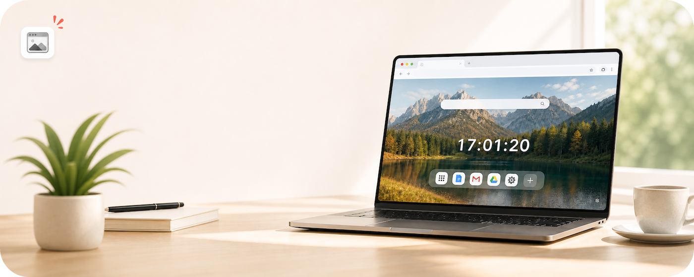
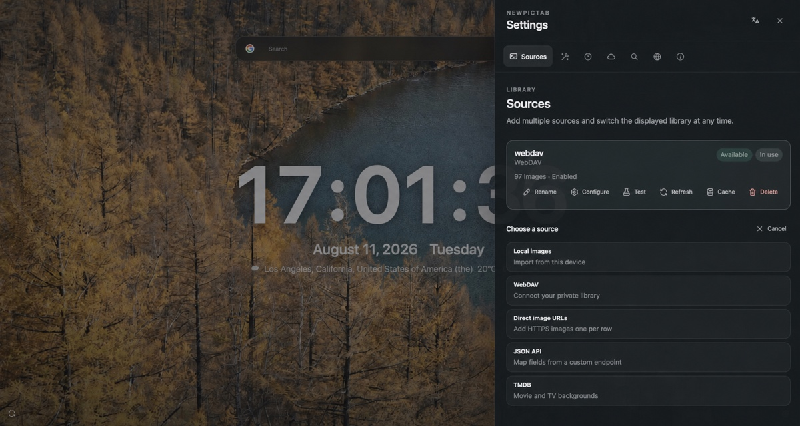

  

<h1 align="center">NewPicTab</h1>

  
  
  

  <b>English</b> | <a href="README_ZH.md">中文</a>

   

## Overview

NewPicTab is a minimal Chrome new-tab extension that keeps your images front and center. You can choose a different image source as the background for the new tab, then show only the clock, date, weather, search, and shortcuts you want.

> NewPicTab is open source under the [MIT License](LICENSE). You may use, copy, modify, and distribute it as long as the copyright and license notices are preserved.

## Preview

<table>
  <tr>
    <td width="50%" align="center">
      
       NewPicTab new tab with clock, weather, and search
    </td>
    <td width="50%" align="center">
      
       NewPicTab settings with image-source controls
    </td>
  </tr>
</table>

## Features

- Use local images, WebDAV, direct HTTPS image URLs, generic JSON APIs, or TMDB.
- Browse images sequentially or randomly, changing them on each new tab or at a set interval.
- Choose from fade, slide, Ken Burns, or no transition; NewPicTab respects the system's reduced-motion preference.
- Enable or disable the clock, date, weather, search, and shortcuts independently.
- Search with Google, Bing, DuckDuckGo, Baidu, or a custom HTTPS search template.
- Add, reorder, and remove shortcuts, with optional local custom icons.
- Extension and built-in search-engine icons are bundled, so the first paint does not depend on remote favicons.
- No NewPicTab account, developer-operated server, ads, analytics, telemetry, or tracking.

## Installation

### Install from Chrome Web Store

### Download from Releases

1. Open the [Releases page](https://github.com/mrjoechen/NewPicTab/releases).
2. Download the latest zip release package.
3. Open `chrome://extensions`.
4. Enable **Developer mode** in the top-right corner.
5. Drag the downloaded zip file onto the extensions page to install it.
6. Open a new tab.

If drag-and-drop is unavailable in your Chrome environment, unzip the package first, then click **Load unpacked** and select the extracted extension directory.

## Image sources

| Type | Description |
| --- | --- |
| Local images | Supports JPEG, PNG, WebP, GIF, and AVIF; files stay in the current Chrome profile. |
| WebDAV | Reads an HTTPS WebDAV directory with optional subdirectories; use a least-privilege app password. |
| Direct image URLs | Add one or more complete HTTPS image URLs. |
| Generic JSON API | Map image URLs, titles, authors, and other fields from an HTTPS API response, with optional pagination and request headers. |
| TMDB | Browse movie or TV backdrops with your own API Read Access Token; no credentials are bundled. |

For user-configured WebDAV, direct URL, and JSON API sources, NewPicTab requests access only to the exact HTTPS origins needed when you test, preview, or refresh the source. It does not receive access to the entire web at installation.

## Privacy and permissions

NewPicTab operates no servers and has no developer-controlled backend. The NewPicTab developer does not collect, receive, store, sell, or track your settings, credentials, images, browsing activity, search history, location, or other personal data. NewPicTab includes no accounts, advertising, analytics, telemetry, or tracking.

Data managed by NewPicTab—including settings, credentials, local images, and caches—is stored locally in your current Chrome profile. NewPicTab does not use Chrome Sync and does not upload this data to NewPicTab or to any server operated by the developer.

NewPicTab makes network requests only when you use a feature that requires an external service. These requests go directly from your browser to the image source or third-party service you selected, such as WebDAV, a JSON API, TMDB, Open-Meteo, BigDataCloud, or a search engine. Data required to complete a request may therefore be transmitted to that third party under its own privacy policy, but it never passes through a NewPicTab server.

- WebDAV passwords, JSON API headers, and TMDB tokens are stored in `chrome.storage.local`. This is not a password vault, so do not reuse your primary account password.
- Weather uses a manually selected city by default. Browser geolocation is requested only after you click **Use current location**, and BigDataCloud is then used to resolve a city name.
- **Settings → About → Clear all NewPicTab data** removes local settings, credentials, images, and caches. It does not delete remote content or revoke site permissions managed by Chrome.

To revoke site access, open `chrome://extensions` → NewPicTab → **Details** → **Site access**.

## Weather and location

Weather data is provided by [Open-Meteo](https://open-meteo.com/en/docs). By default, you enter a city and select it from the search results. NewPicTab then stores only the display name and coordinates locally.

**Use current location** is optional. Loading NewPicTab, enabling weather, or using a manually selected city does not request your location. NewPicTab calls `navigator.geolocation.getCurrentPosition` once only after you explicitly click **Use current location**. Chrome or your operating system may still show its own location permission prompt. The coordinates are sent directly to BigDataCloud's client-side reverse-geocoding endpoint to resolve a city name; weather can still be requested by coordinates if name resolution fails.

Weather and location names use these origins:

- `https://api.open-meteo.com/*` for current weather.
- `https://geocoding-api.open-meteo.com/*` for city search.
- `https://api.bigdatacloud.net/*` only to resolve your current coordinates to a city name after you explicitly request location access.

City searches send the text you enter directly to Open-Meteo's geocoding service. Current-weather requests send the selected location's latitude and longitude directly to Open-Meteo. Recent weather is cached locally so NewPicTab can show a clearly marked stale result during a network failure.

## Permission details

NewPicTab defines no keyboard commands. Its manifest declares exact static host permissions only for its built-in TMDB and weather integrations. WebDAV, direct image URLs, and generic JSON APIs request access to the exact configured HTTPS origin only when you test, preview, or refresh that source.

| Permission | Type | Purpose and activation |
| --- | --- | --- |
| `storage` | Declared at installation | Stores settings, credentials, weather cache, and runtime cursors in the current Chrome profile. NewPicTab does not use `storage.sync`. |
| `unlimitedStorage` | Declared at installation | Allows selected local images and remote-image caches to exceed the small default quota; remote caches still use a bounded cleanup policy. |
| `geolocation` | Declared at installation | Enables the **Use current location** button. Browser location is requested once only after an explicit click. |
| `favicon` | Declared at installation | Uses Chrome's built-in `_favicon` API for shortcuts that you add manually. |
| Two exact TMDB origins | Installation host permissions | Used only for the TMDB API and official image CDN when configuring or using a TMDB source. |
| Two exact Open-Meteo origins and one exact BigDataCloud origin | Installation host permissions | Used for city search, weather, and city-name resolution after explicit location access. |
| `https://*/*` | Optional host-permission declaration | Defines only what NewPicTab may request; it is not granted at installation. NewPicTab derives and requests the exact HTTPS origin needed when you test, preview, or refresh WebDAV, a direct image URL, or a generic JSON API. Chrome can revoke granted site access from the extension details page. |

## TMDB attribution

The TMDB image source requires your own [API Read Access Token](https://www.themoviedb.org/settings/api). Review TMDB's [getting started guide](https://developer.themoviedb.org/v4/docs/getting-started) and [logo and attribution requirements](https://www.themoviedb.org/about/logos-attribution) before configuring it.

This product uses the TMDB API but is not endorsed or certified by TMDB.

TMDB content, trademarks, and API usage remain subject to TMDB's terms. NewPicTab's MIT License does not expand or replace any rights granted by TMDB; review its branding and attribution requirements before publishing or distributing content that uses TMDB.

## Data storage and clearing

Local images are stored in IndexedDB. Remote image bytes are stored in Cache Storage, while directory and least-recently-used metadata are stored in IndexedDB. Settings, credentials, and weather caches are stored in `chrome.storage.local`. Remote cache keys use irreversible digests and do not contain credential-bearing URLs.

After a second confirmation, **Settings → About → Clear all NewPicTab data** removes settings and credentials, local images, remote caches and directories, weather caches, and rotation cursors. It does not delete WebDAV, TMDB, or other remote content, and it does not silently revoke site permissions managed by Chrome.

## License

NewPicTab is licensed under the [MIT License](LICENSE). You may use, copy, modify, merge, publish, distribute, sublicense, or sell copies of the software as long as the copyright and license notices are preserved. The software is provided “as is,” without warranty of any kind. Third-party content and services remain subject to their own terms.
