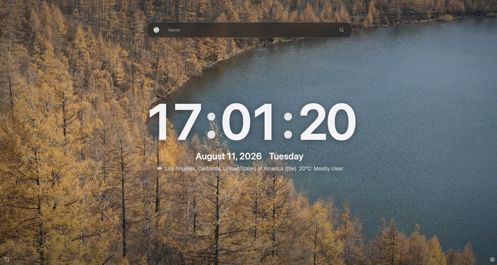
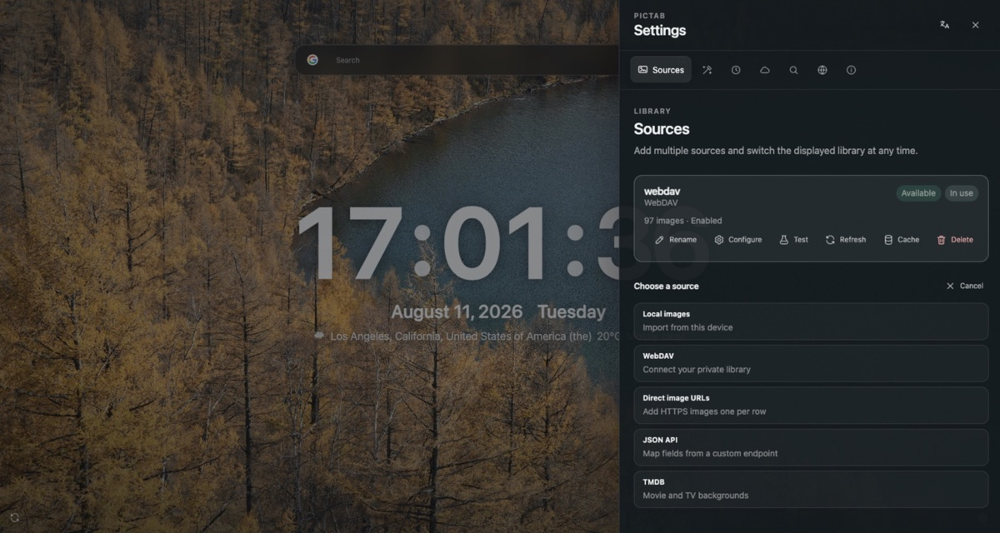

  

<h1 align="center">PicTab</h1>

  
  
  

  <a href="README.md">English</a> ｜ <b>中文</b>

PicTab 是一个以图片为主角的极简 Chrome 新标签页扩展。你可以为浏览器的 Tab 页面背景设置不同的图片源，并按需显示时间、日期、天气、搜索和快捷网址。

> PicTab 采用 [MIT License](LICENSE) 开源，可自由使用、复制、修改和分发，包括商业用途；请保留版权与许可声明。

## 预览

<table>
  <tr>
    <td width="50%" align="center">
      
       显示时间、天气与搜索的 PicTab 新标签页
    </td>
    <td width="50%" align="center">
      
       显示图片源管理的 PicTab 配置页面
    </td>
  </tr>
</table>

## 功能特色

- 支持本地图片、WebDAV、HTTPS 图片 URL、通用 JSON API 和 TMDB。
- 支持顺序或随机换图，可在打开新标签页时切换，也可按时间间隔自动切换。
- 提供淡入淡出、滑动、缓慢推移和无动效四种切换样式，并尊重系统的“减少动态效果”偏好。
- 时间、日期、天气、搜索和快捷网址均可独立开关。
- 内置 Google、Bing、DuckDuckGo 和 Baidu，也支持自定义 HTTPS 搜索模板。
- 快捷网址支持添加、排序、删除和自定义本地图标。
- 扩展图标和内置搜索引擎图标随安装包提供，首次绘制不依赖远程 favicon。
- 无 PicTab 账号、开发者运营的服务器、广告、统计、遥测或跟踪。

## 安装

### Chrome Web Store 安装

### 从 Release 手动下载

1. 打开 [Releases 页面](https://github.com/mrjoechen/PicTab/releases)。
2. 下载最新版本的 zip 发布包。
3. 打开 `chrome://extensions`。
4. 开启右上角的“开发者模式”。
5. 将下载好的 zip 文件拖入扩展程序页面完成安装。
6. 打开一个新标签页。

如果当前 Chrome 环境无法通过拖拽安装，请先解压 zip，再点击“加载已解压的扩展程序”，选择解压后的扩展目录。

## 图片源

| 类型 | 说明 |
| --- | --- |
| 本地图片 | 支持 JPEG、PNG、WebP、GIF 和 AVIF；图片仅保存在当前 Chrome profile 中。 |
| WebDAV | 读取 HTTPS WebDAV 目录，可选择子目录；建议使用权限最小的应用专用密码。 |
| 在线图片 URL | 添加一个或多个完整的 HTTPS 图片地址。 |
| 通用 JSON API | 从 HTTPS API 响应中映射图片 URL、标题、作者等字段，可配置分页和请求头。 |
| TMDB | 使用你自己的 API Read Access Token 浏览电影或电视背景图；项目不内置凭据。 |

用户配置的 WebDAV、在线图片 URL 和 JSON API 会在测试、预览或刷新时申请所需的精确 HTTPS origin 权限，而不是在安装时获得全网访问权。

## 隐私与权限

PicTab 不运营任何服务器，也没有由开发者控制的后端。PicTab 开发者不会收集、接收、存储、出售或跟踪你的设置、凭据、图片、浏览活动、搜索记录、位置或其他个人数据。PicTab 不包含账号系统、广告、统计、遥测或跟踪功能。

PicTab 管理的数据——包括设置、凭据、本地图片与缓存——仅保存在当前 Chrome profile 的本地存储中。PicTab 不使用 Chrome Sync，也不会将这些数据上传到 PicTab 或开发者运营的任何服务器。

只有在你使用需要外部服务的功能时，PicTab 才会发起网络请求。请求会由浏览器直接发送到你选择的图片源或第三方服务，例如 WebDAV、JSON API、TMDB、Open-Meteo、BigDataCloud 或搜索引擎。完成请求所需的数据可能会按照相应第三方的隐私政策发送给该服务，但不会经过 PicTab 服务器。

- WebDAV 密码、JSON API 请求头和 TMDB token 存储在 `chrome.storage.local`；它不是密码库，请勿复用主账号密码。
- 天气默认通过城市查询；只有点击“使用当前位置”时才会调用一次浏览器定位，并通过 BigDataCloud 识别城市名称。
- “设置 → 关于 → 清除所有 PicTab 数据”可清除本地设置、凭据、图片与缓存，但不会删除远端内容或撤销 Chrome 管理的站点权限。

如需撤销站点权限，请前往 `chrome://extensions` → PicTab →“详情”→“网站访问权限”。

## 天气与定位

天气由 [Open-Meteo](https://open-meteo.com/en/docs) 提供。默认流程是用户输入城市并从搜索结果中选择；选择后只在本地保存显示名称和经纬度。

“使用当前位置”是可选流程。PicTab 声明 Chrome 的 `geolocation` 权限以提供此能力，但页面加载、启用天气或手动城市模式都不会调用定位。只有用户明确点击“使用当前位置”时才调用 `navigator.geolocation.getCurrentPosition` 一次；操作系统或 Chrome 仍可能显示自己的定位确认。定位坐标会直接发送到 BigDataCloud 的客户端反向地理编码接口以转换为城市名称；识别失败时仍可使用坐标查询天气。

天气与位置名称涉及以下 origin：

- `https://api.open-meteo.com/*`：当前天气。
- `https://geocoding-api.open-meteo.com/*`：城市搜索。
- `https://api.bigdatacloud.net/*`：仅在主动定位时把当前设备坐标转换为城市名称。

城市搜索会把你输入的文本直接发送给 Open-Meteo 的地理编码服务；当前天气请求会把所选位置的经纬度直接发送给 Open-Meteo。最近天气保存在本地，网络失败时可显示标记为过期的缓存结果。

## 权限明细

PicTab 没有命令快捷键。manifest 只为内置的 TMDB 和天气服务声明精确静态主机权限；WebDAV、在线图片 URL 和通用 JSON API 则在用户测试、预览或刷新图片源时，按实际配置请求精确 HTTPS origin。

| 权限 | 类型 | 用途与触发时机 |
| --- | --- | --- |
| `storage` | 安装时声明 | 保存设置、凭据、天气缓存与运行游标到当前 Chrome profile。PicTab 不使用 `storage.sync`。 |
| `unlimitedStorage` | 安装时声明 | 允许用户选择的本地图片与远程图片缓存超出较小默认配额；PicTab 仍对远程缓存设置有界清理策略。 |
| `geolocation` | 安装时声明 | 仅提供“使用当前位置”按钮；只有明确点击后才调用一次浏览器定位。 |
| `favicon` | 安装时声明 | 通过 Chrome 内置 `_favicon` API 显示用户手动添加的快捷网址图标。 |
| TMDB 两个精确 origin | 安装时 host 权限 | 仅用于 TMDB API 与官方图片 CDN；只在配置或使用 TMDB 图片源时发起网络请求。 |
| Open-Meteo 两个精确 origin、BigDataCloud 一个精确 origin | 安装时 host 权限 | 用于城市搜索、天气和主动定位后的城市名称识别；只在用户使用对应功能时请求。 |
| `https://*/*` | 可选 host 权限声明 | 只是可申请范围，安装时不授予。测试、预览或刷新 WebDAV、在线图片 URL 或通用 JSON API 时，PicTab 从用户配置解析并请求当次所需的精确 HTTPS origin。Chrome 可在扩展详情中撤销已授予的站点访问权。 |

## TMDB 声明

使用 TMDB 图片源需要你自己的 [API Read Access Token](https://www.themoviedb.org/settings/api)。配置前请阅读 [TMDB 官方入门指南](https://developer.themoviedb.org/v4/docs/getting-started)和[标识与归因规范](https://www.themoviedb.org/about/logos-attribution)。

This product uses the TMDB API but is not endorsed or certified by TMDB.

TMDB 内容、商标与 API 使用受 TMDB 自身条款约束。PicTab 代码采用 MIT License，并不表示 TMDB 内容也适用该许可，也不会代替或扩大 TMDB 授予你的权限；发布或分发使用 TMDB 的内容前请核对其标识与归因要求。

## 数据存储与清除

本地图片位于 IndexedDB；远程图片字节位于 Cache Storage，目录和 LRU 元数据位于 IndexedDB；设置、凭据与天气缓存位于 `chrome.storage.local`。远程缓存键使用不可逆摘要，不包含带凭据的 URL。

“设置 → 关于 → 清除所有 PicTab 数据”会在二次确认后清除设置和凭据、本地图片、远程缓存与目录、天气缓存和切换游标。它不会删除 WebDAV、TMDB 或其他远端内容，也不会擅自撤销 Chrome 管理的站点访问权限。

## 许可

PicTab 采用 [MIT License](LICENSE)。该协议允许个人和组织使用、复制、修改、合并、发布、分发、再许可和销售软件副本，包括商业用途；条件是保留原始版权与许可声明。软件按“原样”提供，不附带任何明示或默示担保。第三方内容和服务仍受各自条款约束。
